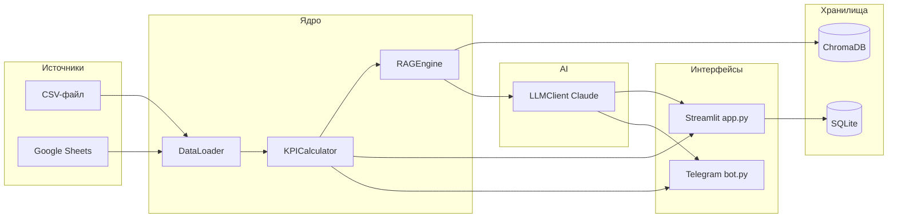

<div align="center">

# 📈 KPI Pulse

### Локальный AI-агент для автоматической аналитики бизнес-KPI

Загружайте данные → считайте метрики → задавайте вопросы AI → получайте дайджест в Telegram.

<br>

[](https://www.python.org/)
[](https://streamlit.io/)
[](https://www.anthropic.com/)
[](https://telegram.org/)
[](tests/)
[](LICENSE)

<br>

[Быстрый старт](#-быстрый-старт) ·
[Возможности](#-возможности) ·
[Архитектура](#-архитектура) ·
[KPI](#-расчёт-kpi) ·
[Telegram-бот](#-telegram-бот) ·
[FAQ](#-faq)

</div>

---

## 💡 Зачем это нужно

**KPI Pulse** — production-ready MVP для малого и среднего бизнеса. Он превращает сырые данные о продажах и маркетинге в понятную аналитику с AI-рекомендациями — без облачных баз и сложной настройки.

<table>
<tr>
<td width="50%">

**🔒 Приватность**
Данные остаются на вашем компьютере. ChromaDB и SQLite — локально. В облако уходят только запросы к Claude и сообщения в Telegram.

</td>
<td width="50%">

**⚡ Быстрый старт**
Один `streamlit run app.py` — и дашборд уже работает с тестовыми данными из `data/sample_data.csv`.

</td>
</tr>
<tr>
<td>

**🤖 Умный анализ**
RAG-движок подтягивает контекст из ваших KPI, Claude отвечает с цифрами и рекомендациями.

</td>
<td>

**📨 Автодайджест**
Telegram-бот отправляет еженедельный отчёт по расписанию — понедельник, 09:00.

</td>
</tr>
</table>

---

## ✨ Возможности

<table>
<tr>
<td align="center" width="25%">
<h3>📊</h3>
<b>Дашборд KPI</b><br>
<sub>5 метрик · графики · аномалии</sub>
</td>
<td align="center" width="25%">
<h3>🤖</h3>
<b>AI-аналитик</b><br>
<sub>Чат с Claude + RAG-контекст</sub>
</td>
<td align="center" width="25%">
<h3>📨</h3>
<b>Telegram-бот</b><br>
<sub>/digest · автоотправка</sub>
</td>
<td align="center" width="25%">
<h3>📁</h3>
<b>Импорт данных</b><br>
<sub>CSV · Google Sheets</sub>
</td>
</tr>
</table>

<br>

| Модуль | Что делает |
|--------|------------|
| **Streamlit-дашборд** | 4 вкладки: данные, KPI-графики, AI-чат, настройки |
| **KPI-калькулятор** | CAC, LTV, MRR, Churn, Conversion + дельты и аномалии |
| **RAG-движок** | ChromaDB индексирует данные для контекстного поиска |
| **AI-аналитик** | Claude отвечает на вопросы с цифрами и рекомендациями |
| **Telegram-бот** | Команды `/start`, `/digest`, еженедельный дайджест по расписанию |
| **Журналирование** | SQLite-аудит AI/Telegram, latency, ошибки, статистика и CSV-экспорт |

<details>
<summary><b>📊 Дашборд KPI — подробнее</b></summary>

- 5 карточек метрик с дельтой к прошлому периоду
- График **MRR** по месяцам (Plotly)
- График **Churn Rate** (столбчатая диаграмма)
- Сравнение **CAC vs LTV** (dual-axis)
- Таблица **аномалий** с подсветкой (метод IQR)

</details>

<details>
<summary><b>🤖 AI-аналитик — подробнее</b></summary>

- Чат с историей (хранится в SQLite)
- Контекст из RAG — ответы опираются на ваши данные
- Системный промпт: цифры → пояснение → рекомендация

</details>

<details>
<summary><b>📨 Telegram-дайджест — подробнее</b></summary>

- `/digest` — дайджест за последний месяц
- `/digest 2026-06` — дайджест за конкретный месяц
- Автоотправка каждый **понедельник в 09:00**

</details>

---

## 🏗 Архитектура



---

## 🛠 Технологический стек

| Категория | Технология |
|-----------|------------|
| Язык | Python 3.10+ |
| Дашборд | Streamlit |
| Данные | pandas, plotly |
| AI | anthropic SDK (claude-sonnet-4-6) |
| RAG | ChromaDB |
| История чата | sqlite3 |
| Telegram | python-telegram-bot, APScheduler |
| Google Sheets | gspread, oauth2client |
| Конфигурация | python-dotenv |
| Тесты | pytest |

---

## 🚀 Быстрый старт

### Требования

- Python **3.10+**
- API-ключ [Anthropic Claude](https://console.anthropic.com/)
- Telegram Bot Token от [@BotFather](https://t.me/BotFather)

### 1. Клонирование и установка

```bash
git clone https://github.com/dimitry8st-prog/KPI-Pulse.git
cd KPI-Pulse
python -m venv venv

# Windows
venv\Scripts\activate

# Linux / macOS
source venv/bin/activate

pip install -r requirements.txt
```

### 2. Настройка `.env`

```bash
cp .env.example .env
```

Минимальная конфигурация:

```env
LLM_PROVIDER=claude
CLAUDE_API_KEY=sk-ant-api03-...
TELEGRAM_TOKEN=123456789:ABCdef...
TELEGRAM_CHAT_ID=6996035129
```

> **Как узнать TELEGRAM_CHAT_ID:** напишите [@userinfobot](https://t.me/userinfobot) — он пришлёт ваш числовой ID.  
> ⚠️ Это **ID пользователя**, а не токен бота.

### 3. Запуск

**Веб-дашборд** → `http://localhost:8501`

```bash
streamlit run app.py
```

**Telegram-бот**

```bash
python bot.py
```

При первом запуске дашборда автоматически загружаются тестовые данные из `data/sample_data.csv` (2024–2026).

### 4. Тесты

```bash
pytest tests/ -v
```

Ожидаемый результат: **26 passed** — покрыты KPI, граничные случаи, журналирование,
анонимизация ID, редактирование секретов и CSV-экспорт.

---

## ⚙️ Переменные окружения

| Переменная | Описание | По умолчанию | Обязательная |
|------------|----------|--------------|:------------:|
| `LLM_PROVIDER` | Провайдер LLM: `claude` или `gigachat` | `claude` | |
| `CLAUDE_API_KEY` | API-ключ Anthropic | — | ✅ для AI |
| `GIGACHAT_API_KEY` | API-ключ GigaChat (заглушка) | — | |
| `TELEGRAM_TOKEN` | Токен бота от @BotFather | — | ✅ для бота |
| `TELEGRAM_CHAT_ID` | Числовой ID чата пользователя | — | ✅ для бота |
| `CHROMA_DB_PATH` | Путь к векторной БД | `./chroma_db` | |
| `SQLITE_DB_PATH` | Путь к SQLite (история чата) | `./kpi_pulse.db` | |
| `LOG_DB_PATH` | Путь к SQLite-журналу взаимодействий | `./kpi_pulse_logs.db` | |
| `MAX_ROWS` | Лимит строк в датасете | `5000` | |

Полный шаблон — в файле [`.env.example`](.env.example).

---

## 📐 Расчёт KPI

| Метрика | Формула | Что показывает |
|---------|---------|----------------|
| **CAC** | `marketing_spend / new_customers` | Стоимость привлечения одного клиента |
| **LTV** | `ARPU × avg_lifespan_months` | Пожизненная ценность клиента (lifespan = 24 мес.) |
| **MRR** | `monthly_revenue` | Ежемесячная выручка |
| **Churn** | `lost_customers / total_start × 100%` | Доля ушедших клиентов |
| **Conversion** | `deals_closed / deals_total × 100%` | Конверсия сделок |

Дополнительно:
- **Дельты** — % изменение каждого KPI к предыдущему месяцу
- **Аномалии** — выбросы методом IQR (межквартильный размах)

---

## 📁 Формат данных

### Обязательные столбцы CSV / Google Sheets

| Столбец | Тип | Пример |
|---------|-----|--------|
| `month` | YYYY-MM | `2026-06` |
| `new_customers` | int | `130` |
| `lost_customers` | int | `43` |
| `revenue` | float | `345000` |
| `marketing_spend` | float | `54000` |
| `total_customers` | int | `2062` |
| `deals_closed` | int | `112` |
| `deals_total` | int | `205` |

### Пример строки

```csv
month,new_customers,lost_customers,revenue,marketing_spend,total_customers,deals_closed,deals_total
2026-06,130,43,345000,54000,2062,112,205
```

### Загрузка данных

**CSV:** вкладка «Данные» → загрузить файл или использовать `data/sample_data.csv`

**Google Sheets:**
1. Создайте сервисный аккаунт в [Google Cloud Console](https://console.cloud.google.com/)
2. Скачайте `credentials.json` в корень проекта
3. Откройте доступ к таблице для email сервисного аккаунта
4. Вставьте URL на вкладке «Данные»

---

## 🖥 Streamlit-дашборд

| Вкладка | Функции |
|---------|---------|
| **Данные** | Загрузка CSV / Google Sheets, превью, валидация схемы |
| **Дашборд KPI** | Метрики, графики MRR / Churn / CAC vs LTV, таблица аномалий |
| **AI-аналитик** | Чат с Claude, история, кнопка «Очистить историю» |
| **Настройки** | Статус API, отправка дайджеста, переиндексация ChromaDB |

При первом запуске появится модальное окно с **условиями использования** (флаг сохраняется в SQLite).

---

## 📱 Telegram-бот

### Команды

| Команда | Действие |
|---------|----------|
| `/start` | Приветствие и список команд |
| `/digest` | KPI-дайджест за последний месяц в данных |
| `/digest 2026-06` | Дайджест за конкретный месяц |

### Формат дайджеста

- Заголовок с указанием периода
- KPI с дельтами и стрелками ↑↓
- Обнаруженные аномалии
- Одна главная рекомендация от AI

### Расписание

Автоматическая отправка: **каждый понедельник в 09:00** (настраивается в `config.py`).

> ⚠️ Запускайте **только один экземпляр** `bot.py`. Несколько процессов вызывают ошибку `409 Conflict` в Telegram API.

---

## 📂 Структура проекта

```
KPI-Pulse/
├── .env.example           # Шаблон переменных окружения
├── .gitignore
├── requirements.txt
├── README.md
│
├── app.py                 # Точка входа Streamlit
├── bot.py                 # Точка входа Telegram-бота
├── config.py              # Константы, Config dataclass, SYSTEM_PROMPT
│
├── data/
│   └── sample_data.csv    # Тестовые данные (2024–2026, 30 строк)
│
├── src/
│   ├── data_loader.py     # CSV / Google Sheets, валидация, detect_structure
│   ├── kpi_calculator.py  # 5 KPI, дельты, IQR-anomalies
│   ├── rag_engine.py      # ChromaDB: index, search, clear
│   ├── llm_client.py      # Claude API, generate_digest
│   ├── interaction_logger.py # SQLite-аудит, метрики и защита секретов
│   ├── telegram_bot.py    # Polling, /start, /digest, scheduler
│   └── db.py              # SQLite: история чата, ToS flag
│
└── tests/
    ├── test_kpi.py        # 24 теста расчёта KPI
    └── test_interaction_logger.py # 2 теста журналирования
```

## Журналирование и наблюдаемость

Реализация следует алгоритму учебного проекта `5-7-new_version`, но адаптирована
к двум интерфейсам KPI Pulse. В отдельную SQLite-базу записываются:

- источник события (`streamlit` или `telegram`) и тип операции;
- статус выполнения, длительность в миллисекундах и текст ошибки;
- вопрос и ответ AI для последующего контроля качества;
- только SHA-256-хеш Telegram ID вместо исходного идентификатора;
- очищенный текст: типовые API-ключи, токены и пароли заменяются на `[REDACTED]`.

На вкладке «Настройки» доступны количество событий, успешные и ошибочные
операции, среднее время ответа и экспорт журнала в `logs/kpi_pulse_interactions.csv`.
Файлы базы, WAL и экспортированные CSV исключены из Git.

---

## 🧪 Тестирование

```bash
# Все тесты
pytest tests/ -v

# Только CAC
pytest tests/test_kpi.py::TestCalculateCac -v

# С покрытием (если установлен pytest-cov)
pytest tests/ --cov=src --cov-report=term-missing
```

Покрыты сценарии:
- ✅ Корректный расчёт при валидных данных
- ✅ `ZeroDivisionError` при нулевых знаменателях
- ✅ Граничные значения (0 клиентов, 100% churn)
- ✅ Parametrize для нескольких наборов данных

---

## ❓ FAQ

<details>
<summary><b>Бот не отвечает на /start</b></summary>

1. Убедитесь, что `python bot.py` запущен и в логах есть `Application started`
2. Проверьте, что работает **только один** экземпляр бота
3. Подождите 30 секунд после перезапуска — Telegram может блокировать polling

</details>

<details>
<summary><b>Ошибка 409 Conflict</b></summary>

Запущено несколько экземпляров `bot.py`. Остановите все процессы и запустите один:

```bash
# Windows — найти и завершить процесс
taskkill /F /IM python.exe

# Затем снова
python bot.py
```

</details>

<details>
<summary><b>AI-аналитик пишет «CLAUDE_API_KEY не задан»</b></summary>

Добавьте ключ в `.env` и перезапустите Streamlit:

```env
CLAUDE_API_KEY=sk-ant-api03-...
```

</details>

<details>
<summary><b>Forbidden: the bot can't send messages to the bot</b></summary>

В `TELEGRAM_CHAT_ID` указан ID бота, а не пользователя. Используйте числовой ID из [@userinfobot](https://t.me/userinfobot).

</details>

<details>
<summary><b>Как получить дайджест за конкретный месяц?</b></summary>

В Telegram:

```
/digest 2026-06
```

Или через Streamlit → вкладка «Настройки» → «Отправить дайджест сейчас» (за последний месяц в данных).

</details>

---

## 🔐 Безопасность

- **Не коммитьте** `.env`, `credentials.json`, `*.db`, `chroma_db/`
- API-ключи храните только локально
- `credentials.json` для Google Sheets добавлен в `.gitignore`
- MVP без авторизации — рассчитан на одного пользователя на локальной машине

---

## 🗺 Roadmap

- [ ] Полная интеграция GigaChat
- [ ] Экспорт дайджеста в PDF
- [ ] Webhook вместо polling для Telegram
- [ ] Кастомные KPI через UI
- [ ] Поддержка нескольких датасетов

---

## 📄 Лицензия

MIT — свободное использование, модификация и распространение.

---

<div align="center">

<br>

**KPI Pulse** · Сделано с ❤️ для data-driven бизнеса

*Вопросы и предложения — через [Issues](https://github.com/dimitry8st-prog/KPI-Pulse/issues) или Pull Request*

<br>

⭐ Поставьте звезду, если проект оказался полезным!

</div>
